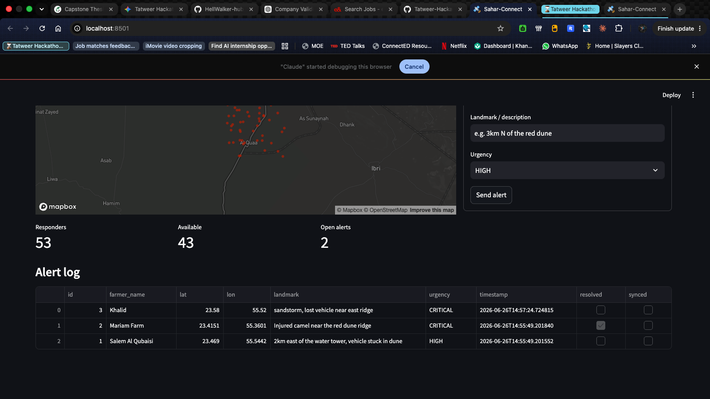

# 🛰️ Sahar-Connect: Desert Emergency Dispatch

**Tatweer Hackathon 2026 Submission** | **Track:** Solutions for rural communities (Challenge 2)

Sahar-Connect is an offline-first, edge-native dispatch framework designed to shorten the gap
between a critical need arising in a dispersed rural setting and the right response reaching the
person. It is built specifically for the geographical realities of Al Qua'a.



---

## 1. The Challenge & The Problem (Criterion 2)
**Challenge 2: Reaching people quickly across a dispersed community.**
Standard city-centric dispatch tools rely on named streets and continuous 5G/cloud connectivity.
In rural, dispersed communities like Al Qua'a — where camel farms are spread across desert
fringes — emergencies (vehicle breakdowns in dunes, injured livestock, rapid-onset sandstorms)
happen off the grid. Centralized dispatch fails when addresses don't exist and the connection drops.

## 2. Target Demographic & Impact (Criterion 1)
**Who it is for:** The residents and farmers of Al Qua'a, specifically those managing livestock
off the main grid, and the local volunteer / civil-defence responders.

**The impact:** Sahar-Connect shifts emergency response from a "call and wait for central
dispatch" model to a "localized neighbour-to-neighbour mesh" model. It identifies the closest
available responder using offline geographic math, cutting critical response time in an
environment where distance and dispersion normally work against speed.

## 3. Our Solution & Testable Claims (Criterion 6)
Sahar-Connect is a localized edge API and kiosk UI that logs distress signals and routes them to
the nearest available responder without a cloud round-trip.

**Testable claims (falsifiability):**
- **Claim 1 — Dispatch needs no external map API.** The closest responder is computed with the
  pure Haversine formula over stored coordinates, in milliseconds, using only the Python standard
  library. *Verify:* `pytest` runs the `routing.py` unit tests (4/4) asserting distance and
  nearest-responder correctness.
- **Claim 2 — Capture and dispatch work fully offline.** Alerts are written to a local SQLite
  store and dispatched by local math; no internet is required for the core flow. *Verify:*
  disable Wi-Fi, raise an alert — it is logged and a nearest responder is returned. (The map
  *tiles* are the only online-dependent visual; the dispatch logic does not depend on them.)
- **Claim 3 — Deterministic, fast cold-start.** Because it is decoupled from any consumer
  cloud-sync layer, the edge node boots and serves the UI in seconds on commodity hardware.

## 4. Feasibility & Readiness (Criteria 3 & 4)
**Readiness:** Complete and demonstrable end-to-end — backend API, geospatial routing engine,
Streamlit kiosk dashboard, and a reproducible seed of **53 responder nodes** placed around Al
Qua'a's real coordinates (deterministic, `seed=42`).

**Deployment feasibility:** This is not a heavy cloud application. It runs on a low-cost edge device
— **verified on a Raspberry Pi 4 Model B** (see the measured Performance table) — at a community
centre or local telecom mast. It uses standard Python libraries — no GPU, no enterprise cloud licensing.

## 5. Scalability After the Hackathon (Criterion 5)
Built for the Al Qua'a pilot, but the architecture is inherently replicable. Each community runs
its own self-contained edge node; scaling means deploying another node elsewhere (e.g. Liwa or
Madinat Zayed). When connectivity allows, the sync engine pushes incident logs up to a central
municipal server — creating a resilient, nation-wide rural safety net from independent local nodes.

---

## ⚡ Performance — measured on the pilot hardware

The full stack (edge API + dashboard + offline satellite-tile server) was deployed and measured on
a **Raspberry Pi 4 Model B (Rev 1.5, 4 GB)** — the actual kind of low-cost node we'd field in Al Qua'a:

| Metric | Measured | Why it matters |
|---|---|---|
| Hardware cost | **~$55 / ~AED 200** (one-off) | deployable at every community hub, not just cities |
| RAM in use (whole system) | **358 MB** (3.4 GB free) | runs on the cheapest Pi; huge headroom |
| Cold boot → serving | **~24 s** (power-on to ready) | plug it in and it's live; no operator needed |
| CPU temperature | **43 °C**, passive | no heatsink/fan; survives a hot kiosk |
| Power draw | **~3 W idle / ~5 W load** | runs off a power bank or small solar panel |
| Internet required | **None** | own WiFi hotspot + cached tiles + on-device routing |
| Offline alert capture | **Verified** | an alert was logged with the Ethernet **physically unplugged** |

These are measured facts, not estimates: a sub-$60 box that boots in under half a minute, sips ~5 W,
and dispatches emergencies with **zero internet** — exactly the deployability the challenge demands.

---

## 🔬 Evidence & Validation (Criterion 6)

Every claim here is checkable, and the checks live in this repo:

| Claim | Evidence | Verify it yourself |
|---|---|---|
| The routing math is correct | 4/4 unit tests on Haversine + nearest-responder | `pytest -q` |
| Dispatch is effectively instant | nearest responder over 53 nodes in **~0.04 ms** (mean; p95 0.047 ms) on dev hardware; the algorithm is O(n) over a few dozen nodes, so it stays sub-millisecond on the Pi | `src/edge_api/routing.py` |
| It works with **zero internet** | a phone alert raised with the **Ethernet physically unplugged** was logged to the Pi's local DB (alert `id:5`) | unplug test → `curl http://10.42.0.1:8000/alerts` |
| It runs on cheap hardware | measured on a Pi 4 B: 358 MB RAM, ~24 s boot, 43 °C, ~5 W | `free -h`, `systemd-analyze`, `vcgencmd measure_temp` |
| The scene is reproducible | deterministic seed (`seed=42`) places 53 responders around Al Qua'a | `python -m src.ai_modules.generate_mock_data` |

Visual proof is in the hero screenshot above and the demo video below.

## 🧭 Limitations & Honesty

We'd rather show our edges than oversell them. What is **not** done yet:

- **Responder data is simulated.** The 53 responders are synthetic coordinates around Al Qua'a, not
  a real registry. A real deployment needs an onboarding step for actual neighbours and responders.
- **The SMS is a simulated payload, not a live send.** We generate the exact message an SMS gateway
  (e.g. Twilio) would send and label it as such in the UI; wiring a real gateway needs connectivity
  and an account, which we deliberately left out to keep the core fully offline.
- **No field testing with real users yet.** Our evidence is technical (tests, hardware metrics,
  offline verification) — not a user study. A pilot with real Al Qua'a residents is the next step,
  and we don't yet have a measured local baseline (e.g. current response times) to quantify impact.
- **Phone location UX is basic.** Tap-to-place and a "simulate GPS" button work; a one-tap
  "use my GPS" needs HTTPS (a browser policy, not a GPS limit) and is on the roadmap.
- **Offline tiles cover a bounded area.** Outside the cached Al Qua'a bounding box the satellite
  basemap won't render offline — dispatch still works regardless.

## 🛡️ Anticipating the Hard Questions

- **"Why not just call 999?"** In dispersed desert with no street addresses, the bottleneck isn't
  the call — it's conveying *where* you are and reaching the *nearest able* responder fast.
  Sahar-Connect captures precise coordinates, routes to the closest available unit, and keeps
  working when the cellular signal doesn't.
- **"What if no responder is nearby?"** It returns the nearest available unit with distance/ETA; if
  none are free it broadcasts to all neighbours. Coverage improves as more neighbours register —
  that's the mesh model.
- **"How do you *know* it's offline?"** We unplugged the Ethernet and a phone alert still logged and
  dispatched (alert `id:5`); both the map tiles and the routing come from the Pi itself.
- **"What about people without smartphones?"** The edge API is input-agnostic — the same backend can
  accept a structured SMS or a fixed kiosk at the community hub. The phone UI is just one client.
- **"Is this a demo or could it run for real?"** It runs on a $55 Pi at ~5 W, boots in ~24 s, and
  needs no cloud (see Performance). The honest gaps are listed under Limitations.

---

## 🏗️ Architecture

```
[ Farmer / Kiosk UI ]            Streamlit dashboard (touch-friendly)
          │  raise alert (tap location + describe)
          ▼
[ Edge API  ·  FastAPI ]         runs locally on the edge node
          │  1. save to local store (never lost offline)
          │  2. Haversine -> nearest available responder
          ▼
[ Local store · SQLite ]  --->  [ Sync engine ]  --->  [ Central server ]
   alerts + responders           when online, flush        (future / record-keeping)
                                 unsynced alerts
```

**In one sentence:** Sahar-Connect replaces a centralized cloud dispatch system with a localized,
offline-resilient microservice that runs on cheap hardware directly in the community.

---

## ⚙️ How to Run and Verify (Criterion 7)

**Prerequisites:** Python 3.10+

**1. Clone & set up the environment**
```bash
git clone https://github.com/HellWalker-hub/tatweer-framework.git
cd tatweer-framework
python3 -m venv .venv
source .venv/bin/activate
pip install -r requirements.txt
```

**2. Run the tests** (verifies the offline routing math — Claim 1)
```bash
pytest -q          # expect: 4 passed
```

**3. Seed the Al Qua'a database** (53 responder nodes + sample alerts)
```bash
python -m src.ai_modules.generate_mock_data
```

**4. Start the edge API** (terminal 1)
```bash
uvicorn src.edge_api.main:app --reload      # http://localhost:8000/docs
```

**5. Start the kiosk dashboard** (terminal 2)
```bash
streamlit run src/dashboard/app.py          # http://localhost:8501
```

Open `http://localhost:8501`. To prove the offline claim: disconnect from the internet, raise an
alert, and confirm it is logged and a nearest responder is dispatched.

> **Note on commands:** the seeder and sync worker are Python packages, so run them with `python -m`
> (module form), not `python src/...` — the module form sets up the package imports correctly.

---

## 🎥 Demo

> **Demo video:** _add link or `docs/demo.mp4` here before submitting._

The video walks the full offline loop: a phone joins the Pi's `Sahar-Connect-Emergency` hotspot →
raises an alert → the nearest responder is dispatched on the satellite map → **the Ethernet cable is
unplugged and the system keeps working** — no internet, no cloud.

## 🧰 Tools
Built with **FastAPI**, **Streamlit**, **SQLAlchemy/SQLite**, **folium**, and **pandas**. Geospatial
routing uses the standard-library Haversine formula. Offline basemap is cached **Esri World Imagery**.
No ML/GPU dependencies.

## 📄 License / Open source
Released publicly as required by the Tatweer Hackathon. The framework is intended to be reusable
by other rural communities across the UAE.

_Tatweer Hackathon · Al Qua'a, Al Ain · 2026_
